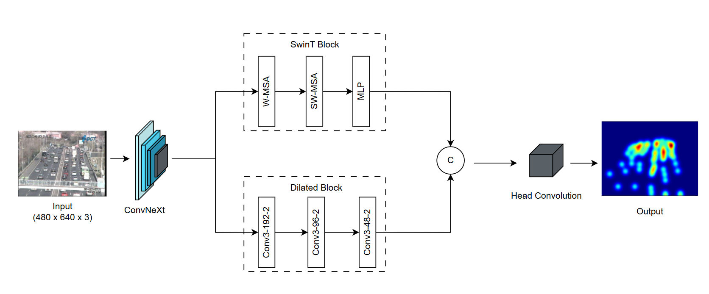

# Architecture


# Environment
- Python version: 3.10.20
- Install Torch:
    - If using CPU:
        ```sh
        pip install torch==2.1.2 torchvision==0.16.2
        ```
    - If using CUDA:
        ```sh
        pip install torch==2.1.2 torchvision==0.16.2 --index-url https://download.pytorch.org/whl/cu118
        ```
- Install essential packages:
```sh
pip install -r requirements.txt
```


# How to train?
## 1. Preprocessing TRANCOS dataset
- Download archived package here: [TRANCOS-V3-27-May-15](https://universidaddealcala-my.sharepoint.com/:u:/g/personal/gram_uah_es/Eank6osXQgxEqa-1bb0nVsoBc3xO4XDwENc_g0nc6t58BA?&Download=1)
- Using `data_preprocess.py` script
- Open the script and change path to your TRANCOS dataset by updating `dataset_path` variable.
```py
python data_preprocess.py
```
## 2. Train
- Open the script `train.py` and change path to your TRANCOS dataset by updating `dataset_path` variable.
- Using command: `python train.py`

## 3. Validation
- Open the script `val.py` and change path to your TRANCOS dataset by updating `dataset_path` variable.
- Set the model checkpoint to `CHECKPOINT` macro.
  The best model can be downloaded from: [Google Drive](https://drive.google.com/file/d/1Az5CE0ZuFmWFTqOPWX8_IdkZSqI-tdT0/view?usp=sharing)
- If you want to output the density overlay image, set `VIZ=True` inside `val.py`.
- Using command: `python val.py`